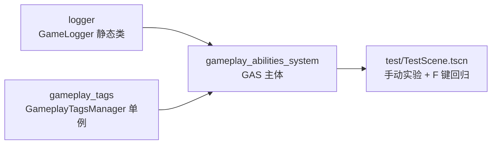

# gas_project

基于 Godot 4 的 **Gameplay Ability System（GAS）** 实现——把 UE 的 GAS 框架概念翻译成
Godot 的语言习惯（Resource 配方 / RefCounted 实例 / Node 驱动 / signal 通信）。

本项目由 **三个相互协作的插件** 组成：

| 插件 | 一句话职责 | 位置 |
| --- | --- | --- |
| `logger` | 带时间戳/颜色/文件落盘的统一日志器 | `addons/logger` |
| `gameplay_tags` | 全局唯一的层级标签系统（神经系统） | `addons/gameplay_tags` |
| `gameplay_abilities_system` | 能力 / 属性 / 效果系统本体（大脑） | `addons/gameplay_abilities_system` |



---

## 1. logger —— 日志器

所有日志的统一出口，GAS 各模块的消息都经过它输出（带时间戳与颜色分级），
并自动落盘到 `user://game.log`。

- 全局 `class_name GameLogger`，任意脚本直接调用，无需挂节点；
- 四级日志：`debug` / `info` / `warn` / `error`，`error` 同时接入引擎
  `push_error`（调试器红字 + 断点）；
- `min_level` 运行时可调门槛；release 构建自动丢弃 DEBUG 级；
- 输出格式：`[INFO][15:33:24][ModuleName]: 消息`，支持调用位置定位
  （`show_caller=true`）。

```gdscript
GameLogger.info("MyModule", "hello")
GameLogger.warn("MyModule", "something wrong", true)   # 末尾附 文件:行号
```

---

## 2. gameplay_tags —— 标签系统

仿 UE `FGameplayTag` 的层级标签（如 `State.Debuff.Stun`），GAS 用它描述
角色状态、冷却、Buff、技能条件等一切"存在性"信息。

- **享元池**：每个标签名全工程只有一个 `FGameplayTag` 实例，`==` 即身份判断；
- **双轨索引**：哈希表 O(1) 查找 + 多叉树维护层级；
- **祖先链缓存**：`A.B.C` 匹配 `A.B` 的判断是 O(1)；
- **引用计数**：多来源授予同一标签不会误删（ASC 侧）；
- **编辑器支持**：底部面板 GameplayTags Manager 管理 `config/*.cfg` 中的
  标签清单与重定向，Inspector 中有标签容器专用编辑器。

```gdscript
var tag: FGameplayTag = GameplayTags.request_gameplay_tag(&"State.Debuff.Stun")
tag.matches_tag(GameplayTags.request_gameplay_tag(&"State.Debuff"))  # true
```

> Autoload 单例名：`GameplayTags`

---

## 3. gameplay_abilities_system —— GAS 本体

仿 UE GAS 的能力 / 属性 / 效果框架，核心模块：

| 模块 | 类 | 说明 |
| --- | --- | --- |
| 核心中枢 | `GASAbilitySystemComponent` | 大脑：执行 GE、管理标签/能力/依赖登记簿、`_process` 心跳 |
| 属性 | `GASAttributeSet` / `GASAttributeDATA` | BaseValue（永久）+ CurrentValue（租约），`evaluate()` 聚合权威 |
| 效果 | `GASGameplayEffect` / `GASEffectSpec` | 配方 → 实例：INSTANT / DURATION / INFINITE + 周期 DoT + Stacking |
| 数值公式 | `GASModifierMagnitude` 家族 | ScalableFloat / AttributeBased / SetByCaller 快照与实时 |
| 执行器 | `GASExecutionCalculation` | 多属性攻防结算（输出小票多方向落账） |
| 能力 | `GASGameplayAbility` | 标签门禁 + 消耗/冷却 GE + activate/commit 分离 + push 打断 |
| 异步 | `GASAbilityTask` | Node 化异步等待（Delay 已完成，WaitInput/Anim 排队） |

**快速体验**：打开 `addons/gameplay_abilities_system/test/TestScene.tscn`
运行，按 `F` 一键自动化回归；其余按键见
[System_Architecture.md](docs/System_Architecture.md#122-动手实验testscene)。

```gdscript
# 最小示例：扣 50 血
var asc: GASAbilitySystemComponent = GASAbilitySystemComponent.new()
character.add_child(asc)
var ge: GASGameplayEffect = load("res://ge_damage.tres")   # INSTANT, Health ADD -50
asc.apply_gameplay_effect_spec_to_self(asc.make_effect_spec(ge))
```

---

## 文档

| 文档 | 内容 |
| --- | --- |
| [docs/System_Architecture.md](docs/System_Architecture.md) | **架构完全指南**（Mermaid 图解，由浅入深，含与 UE 对照，初学者友好） |
| [docs/GAS_Documentation.md](docs/GAS_Documentation.md) | UE GAS 概念参考 + Godot 重写设计与实现状态 |
| [addons/gameplay_abilities_system/README.md](addons/gameplay_abilities_system/README.md) | GAS 插件使用手册（完整链路示例） |
| [addons/gameplay_abilities_system/DEVLOG.md](addons/gameplay_abilities_system/DEVLOG.md) | 开发日志：设计决策、踩坑记录、九条原则 |

## 设计原则（速览）

1. **先记账，再放权** —— 框架状态登记先于用户代码
2. **唯一收尾漏斗** —— 所有死亡路径汇入一个清理函数且幂等
3. **门票代替引用** —— 跨系统凭据用 handle（int），旧票无害化
4. **Resource = 定义，Spec = 实例** —— 运行时数据永不进共享配方
5. **校验压在边界** —— 配置合法性在装载时一次查完
6. **计数 + 跳变沿** —— 信号只在存在性真正改变时发
