# Gameplay Ability System 架构完全指南（Godot 实现版）

> 本文档面向**初学者**：从"为什么要做 GAS"开始，由浅入深讲透本项目的系统设计、
> 每个设计决策背后的**为什么**，并全程与 **Unreal Engine 的 GAS** 对照。
> 读完本文档，你应该能完整复述：一次技能施放从按键到伤害落地的每一步，
> 以及每个模块为什么长成现在这个样子。

---

## 导读：怎么读这份文档

| 章节 | 内容 | 难度 |
| --- | --- | --- |
| 第 0 章 | 问题与动机：为什么需要 GAS | ⭐ 热身 |
| 第 1 章 | 三个世界的分层（最重要的心智模型） | ⭐ 必读 |
| 第 2 章 | GameplayTags：全局唯一的"神经系统" | ⭐⭐ 基础 |
| 第 3 章 | 属性系统：BaseValue / CurrentValue | ⭐⭐ 基础 |
| 第 4 章 | GameplayEffect：数据驱动的"激素信号" | ⭐⭐⭐ 核心 |
| 第 5 章 | ASC：系统的大脑 | ⭐⭐⭐ 核心 |
| 第 6 章 | GameplayAbility：动作命令 | ⭐⭐⭐ 核心 |
| 第 7 章 | AbilityTask：异步时钟 | ⭐⭐⭐ 核心 |
| 第 8 章 | 数值计算进阶：快照 / 执行器 / 依赖重算 | ⭐⭐⭐⭐ 进阶 |
| 第 9 章 | Stacking：叠层策略 | ⭐⭐⭐⭐ 进阶 |
| 第 10 章 | 完整链路：火球术全流程 | ⭐⭐⭐⭐ 收网 |
| 第 11 章 | 与 UE 的全面对比与设计原则 | ⭐⭐⭐ 沉淀 |
| 第 12 章 | 项目结构、测试与路线图 | ⭐ 附录 |

> **阅读建议**：第 1 章没读懂不要往下走；第 3、4、5 章是三根柱子；
> 第 10 章是"期末考试"——如果第 10 章的时序图你能逐帧讲出"为什么这么走"，就算毕业了。

---

## 第 0 章 问题与动机：为什么需要一个 GAS？

### 0.1 我们要解决什么问题

做一个 RPG/MOBA 类游戏，你会遇到这些需求：

- 角色有血量、法力、攻击力等**数值属性**，并且能被"掉血""加攻击"等**效果**修改；
- 技能（能力）有**消耗**（扣蓝）、**冷却**、**标签条件**（眩晕中不能放技能）；
- 有各种**状态效果**：眩晕 3 秒、中毒每秒掉 5 点血、攻击力 +30 的 Buff；
- 状态之间会互相影响：眩晕要**打断**正在蓄力的技能；被眩晕时**拒绝**新技能激活；
- 表现（特效/音效）与逻辑分离，方便替换。

### 0.2 直接硬编码为什么不行？

假设第一版你直接写：

```gdscript
# 伪代码：硬编码版
func on_damage_taken(amount: float):
    health -= amount
    if health <= 0:
        die()
```

一开始能跑。但当你需要：
- 护盾先吸收、护甲减免、暴击倍率、装备加成、Buff 叠加……
- 眩晕期间伤害免疫、中毒每跳结算、治疗上限钳制……

**判断逻辑会指数级膨胀**：每个技能都要自己写"先查有没有护盾、再查护甲、再查是否眩晕……"。
代码到处 if/else 互相耦合，策划想调一个数值必须改代码。**这就是 GAS 要解决的问题**：

> **把"数值的变化"从"游戏逻辑"中彻底剥离，做成一套数据驱动的、可组合的规则系统。**

- 策划改数值 → 只改配置（.tres），不碰代码；
- 新效果（眩晕/灼烧/护盾）→ 组合已有积木，不写新逻辑；
- 所有"改属性"的行为**只有一条合法通道**（GE），系统才能统一管生命周期、钳制、信号。

### 0.3 为什么在 Godot 里"重写"UE 的 GAS？

GAS（Gameplay Ability System）是 Epic 在 UE 中开发的框架，Fortnite、Paragon 等
AAA 游戏实战验证过。Godot 没有现成 GAS，本项目**把 UE 的 GAS 概念翻译成 Godot 的
语言习惯**实现了一遍。

翻译不是照抄，因为两种引擎的"母语"不同：

| 维度 | UE | Godot（本项目） |
| --- | --- | --- |
| 对象体系 | UObject + C++ 宏 + Blueprint | Object / Node / Resource |
| 数据资产 | UDataAsset / DataTable | Resource（.tres 文件） |
| 事件回调 | Delegate（多播委托） | signal（信号） |
| 类管理 | 大量枚举 + 配置类 | GDScript class_name |
| 网络复制 | 内置 RPC + Property Replication | 无内置权威模型 |

> **本项目明确不做网络同步与客户端预测**（单机项目）。但架构上保留了
> 将来扩展的可能——后面会看到，"门票"（handle）、"快照/实时"这些概念
> 本身就是预测系统的种子。

### 0.4 系统总览：一张图先看全貌

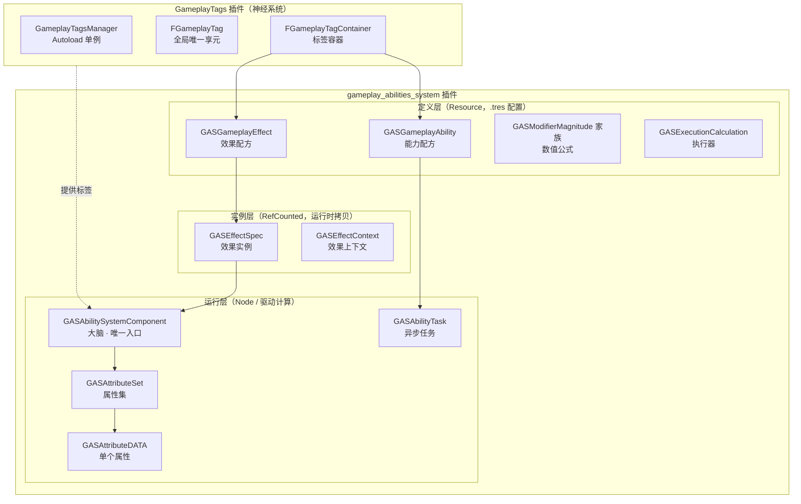

一句话总览：**ASC 是大脑，GE 是激素信号，Ability 是动作命令，Task 是时钟，Tag 是神经**。
下面逐层拆开。

---

## 第 1 章 三个世界的分层（最重要的心智模型）

### 1.1 为什么要分层

回忆 0.2 的问题：数值要可配置、可组合、可回滚。这些需求指向同一个答案——
**把"是什么"（定义）和"这一次发生了什么"（实例）分开**。

举个生活例子：**菜谱 vs 一道菜**。
菜谱（Recipe）是共享的、永远不变的文字；一道菜是按菜谱做出来的、加了厨师
这次手抖放多盐的**具体存在**。你做两盘菜，共享一份菜谱，但两盘菜互不干扰。

GAS 的分层正是这个：

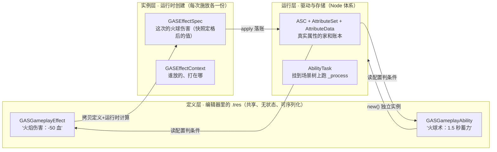

**为什么三层的每一条都要这么分？**

1. **定义层用 Resource**：Godot 的 Resource 可以 `@export`、可以保存成 `.tres` 文件、
   可以被多个节点共享引用。策划在编辑器中配置 `ge_damage_50.tres`（Health, ADD, -50），
   游戏代码一行不用改。
2. **实例层用 RefCounted**：Spec 每次施放 new 一个，它把定义层的静态数值和**这次运行时
   才知道的东西**（等级、施法者属性、调用方传的值）合并成"定案数据"。
3. **运行层用 Node**：ASC 需要 `_process`（心跳倒计时）、需要挂到场景树上被管理；
   属性是"会变的数据"，需要被信号监听。

> 一个最有力的证明：**GE 是共享资源，如果 Modifier 的数值直接存在 GE 上，
> 两发同时飞行的火球会互相覆盖数值**（DEVLOG 中"两枚同款戒指"论证）。
> 所以每次施放必须 new 一个 Spec 副本——这就是"配方与菜"必须分离的铁证。

### 1.2 Godot 对象三选一：Resource / RefCounted / Node

这是本项目最重要的选型规则，初学者先背下来：

| 类型 | 特点 | 本项目用它装什么 | 为什么 |
| --- | --- | --- | --- |
| `Resource` | 可序列化（.tres）、可共享引用、可 @export | GE 配方、Ability 配方、Modifier、magnitude、Tag 容器、TagRequirements | 要进编辑器配置的一切 |
| `RefCounted` | 纯内存数据，引用计数自动释放 | Spec、Context、AttributeData、ModifierPile、EvaluatedData | 运行时一次性数据，不需要序列化 |
| `Node` | 挂场景树、有 `_process`、有生命周期信号 | ASC、AbilityTask | 需要每帧驱动、需要被树管理 |

**三个典型错误及其后果**（都是本项目踩过的坑）：

- ❌ 把运行时状态（`stack_count`）塞进定义层 Resource → 共享污染，下一次施放读到脏数据；
- ❌ 把配置（`duration_policy`）写在代码里 → 策划改不了、.tres 失去意义；
- ❌ 把 Task 做成 RefCounted → 没有 `_process`，倒计时没人驱动（见第 7 章）。

### 1.3 与 UE 对照：CDO 的概念

UE 里每个 UObject 资产也有"定义/实例"之分（CDO：Class Default Object），
`UGameplayEffect` 资产共享一份，apply 时创建 `FGameplayEffectSpec` 实例——
和本项目 `GASGameplayEffect` → `GASEffectSpec` **完全同构**。
UE 把"菜谱"和"菜"分得清清楚楚，本项目只是用 GDScript 的方式复刻了这个思想。

---

## 第 2 章 GameplayTags：全局唯一的"神经系统"

### 2.1 什么是 GameplayTag

GameplayTag 是形如 `State.Debuff.Stun` 的**分层命名标签**，用 `.` 表示层级关系。

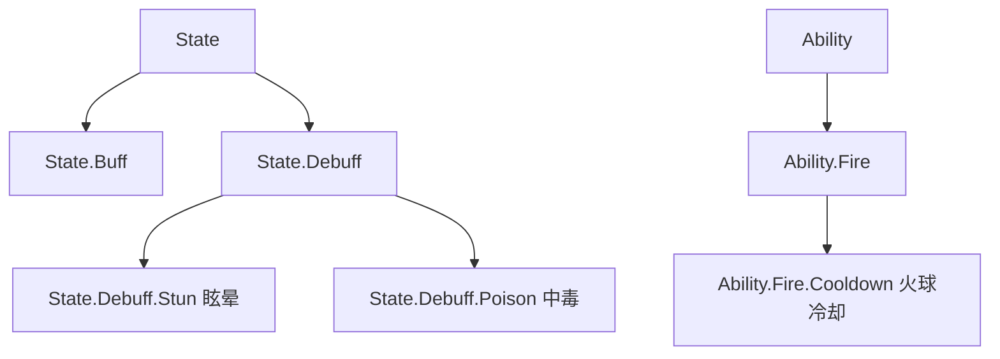

Tag 解决的是**"描述状态"**的问题：

- 角色被眩晕 → 拥有 tag `State.Debuff.Stun`；
- 技能在冷却 → 拥有 tag `Ability.Fire.Cooldown`；
- 技能配置"被 `State.Debuff` 打断" → 眩晕一出现技能就被取消。

**为什么用层级 tag 而不是布尔变量？**
因为 `State.Debuff.Stun` 和 `State.Debuff` 是**同一件事的不同粒度**。
问"是否被眩晕"和问"是否处于任何负面状态"应该都能回答——层级匹配（见 2.3）让
一个查询同时回答粗细两个问题。布尔变量做不到这一点。

### 2.2 实现：享元池 + 双轨索引 + 祖先链缓存

Tag 系统是独立的 `gameplay_tags` 插件，核心是 Autoload 单例 `GameplayTagsManager`：

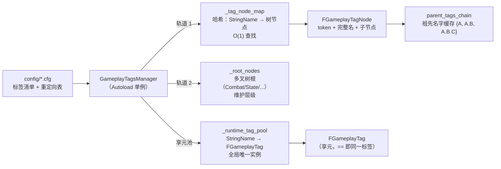

三个关键设计：

1. **享元池（Flyweight）**：`State.Debuff.Stun` 这个名字全工程**只有一个** `FGameplayTag`
   对象实例。比较两个标签是否相同 = 比较对象引用（`==`），速度等同整数比较。
   UE 对应：`FGameplayTag` 内部是一个 `FName` 全局 ID。
2. **双轨索引**：哈希表负责 O(1) 找到标签；多叉树负责维护层级结构
   （编辑器里展示、未来做标签合法性校验）。
3. **祖先链缓存**：注册 `A.B.C` 时，节点上直接缓存 `{A, A.B, A.B.C}`。
   判断"`A.B.C` 是否匹配 `A.B`"时查缓存字典 → **O(1)**。
   UE 对应：`FGameplayTagContainer::HasTagExact/MatchesTag`（UE 也做了
   Tag → 祖先集 的映射优化）。

### 2.3 两个核心查询

```gdscript
tag_a.matches_tag(tag_b)   # 层级匹配：A.B.C 匹配 A.B → true（自身也匹配自身）
asc.has_tag(tag)           # 我是否持有 tag（含家族匹配：持有 A.B.C 时查 A.B 也 true）
```

**方向约定**（容易搞反，务必记住）：
> "具体的"（自己持有的长标签）调用 `matches_tag`，参数传"宽泛的"（查询用的短标签）。
> 即：**持有 `State.Debuff.Stun` 时，查 `State.Debuff` 应命中**。

### 2.4 引用计数：谁授予，谁撤销

一个 tag 可能被**多个来源**同时授予（两枚"风暴之盾"戒指都授予同一个状态标签）。
如果用布尔集合，脱一枚戒指会把状态整个抹掉——**错误的**。

所以 ASC 内部用 `_tag_counts: Dictionary{FGameplayTag: int}` 做**引用计数**：

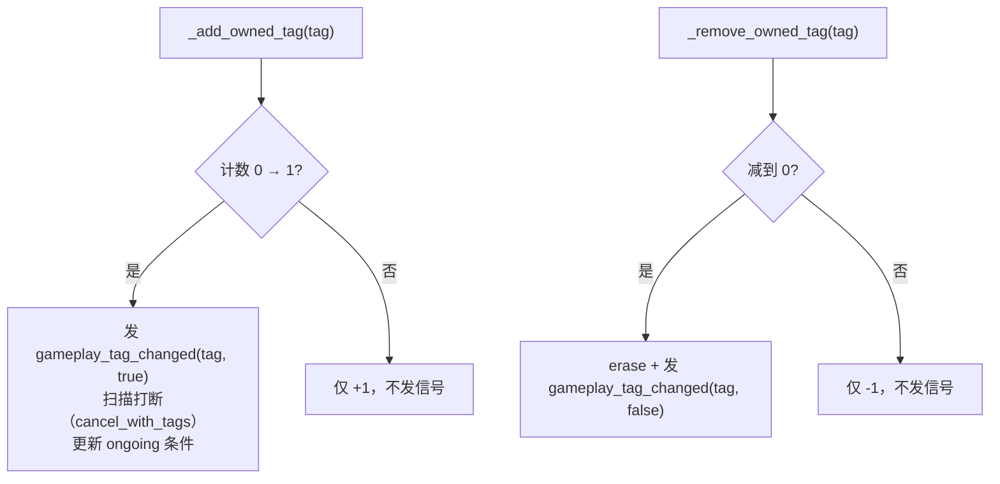

**为什么信号只在 0↔1 跳变沿发？**
订阅者（UI 状态栏、技能打断逻辑）关心的是"这个状态**存在性**变了"，而不是
"有人动过它"。1→2 时状态一直在，没有任何事件发生。

> UE 对照：`FGameplayTagCountContainer` 同样用计数 + 委托，
> 并且维护了**祖先计数**实现 O(1) 查询（本项目暂用遍历键 + matches_tag，记入遗留）。

### 2.5 与 UE 对照小结

| 能力 | UE | 本项目 |
| --- | --- | --- |
| 标签本体 | `FGameplayTag`（FName 全局 ID） | `FGameplayTag`（StringName + 享元池） |
| 层级匹配 | `MatchesTag` / `MatchesTagExact` | `matches_tag`（祖先链缓存 O(1)） |
| 容器 | `FGameplayTagContainer`（TSet） | `FGameplayTagContainer`（Dictionary 键集） |
| 运行时计数 | `FGameplayTagCountContainer` | ASC 内 `_tag_counts` 引用计数 |
| 编辑器工具 | GameplayTags 编辑器 | 底部面板 GameplayTags Manager |

---

## 第 3 章 属性系统：BaseValue / CurrentValue

### 3.1 属性 = 两个值的叠加

一个"血量"属性其实由两部分构成：

| 值 | 含义 | 谁改它 | 例子 |
| --- | --- | --- | --- |
| `base_value` | 永久值（存折里的钱） | INSTANT 效果（买断式） | 受到 50 点伤害，血永久少 50 |
| `current_value` | 当前值 = base + 临时修改（兜里的钱） | DURATION/INFINITE 效果（租约式） | "攻击力 +30" 的 Buff，到期自动恢复 |

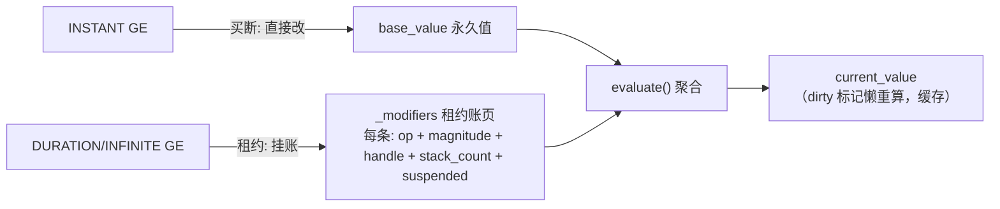

**为什么要两个值？** 因为"治疗、扣血"是永久性的，而"Buff"必须是可回滚的。
如果 Buff 直接改 BaseValue，到期后没人记得原来的值是多少——系统必须能精确撤销。

### 3.2 聚合公式（evaluate）：唯一的"合账权威"

多个修改器同时挂在一个属性上（护盾 +30、虚弱 -20%、光环 ×1.2），
合并成一个数有**固定的顺序**：

```text
1. 先查 OVERRIDE：存在 → 直接返回（短路，其他全无视）
2. result = base_value
3. result += 所有 ADD 的 magnitude × stack_count
4. result ×= 所有 MULTIPLY 的 (1 + magnitude)
5. result ÷= 所有 DIVIDE 的 (1 + magnitude)
```

> **注意乘法/除法的语义**：MULTIPLY 0.5 表示 ×1.5；DIVIDE 2 表示 ÷3
> （即除以 1+2）。想"÷2"要写 DIVIDE 1.0。这是本项目踩过 166 事件的教训
> （期望 500÷2=250，实际 500÷3≈166.67）——**1+m 语义是合同，写值前先背**。

**为什么顺序必须是 ADD → MUL → DIV？**
这是"后到的修改建立在先到的结果之上"的自然约定（先加减、再按比例缩放），
与 UE `FAggregator::EvaluateWithBase` 的语义一致。但注意：顺序对**所有修改器**
统一生效，与施加先后无关（`[×1.2, +50]` 和 `[+50, ×1.2]` 结果相同）——
**聚合是无序的纯函数**，这正是它适合做"唯一权威"的原因。

### 3.3 两个钩子：Pre 钳制（门禁）与 Post 连锁（决策）

这是属性系统设计中最精妙的一对：

```gdscript
# 写在 AttributeSet 子类里

## 钩子 1：写入 base 之前的门禁 —— 纯函数，只回答"这个值允许是多少"
func pre_attribute_change(attr_name: StringName, new_value: float) -> float:
    match attr_name:
        &"Health":
            return clamp(new_value, 0.0, _attributes[&"MaxHealth"].current_value)
    return new_value

## 钩子 2：GE 结算完毕后的连锁反应 —— 允许有副作用，回答"这次改动引发什么"
func post_gameplay_effect_execute(effect_spec: GASEffectSpec):
    # 例：把 IncomingDamage 按"护盾 → 血量"的顺序分配，死亡检测也在这里
    pass
```

**为什么必须是两个钩子？**

| 钩子 | 职责 | 约束 |
| --- | --- | --- |
| `pre_attribute_change` | 钳制（血不能为负、蓝不超过上限） | **纯函数**：只修传入的值，不碰其他属性（防递归） |
| `post_gameplay_effect_execute` | 连锁（护盾先扛、溢出转护盾、死亡检测） | 可以自由做有副作用的事 |

> 钳制为什么不能做成有副作用的逻辑？设想"血减少 100，先扣护盾再扣血"——
> 这个决策需要知道"这次 GE 是什么"（有没有护盾吸收量），而钳制只是
> 一个"数值合法的范围检查"，它不该也不被允许看到这些。**纯函数防递归**：
> 如果钳制里去改别的属性，改属性的动作又会触发钳制，无限递归。

**一条铁律**：写入 base 的唯一入口是 `apply_base_value_change()`，
外部（和框架自己）都不得直接 `set_base_value`——否则钳制和信号全部绕开。

### 3.4 Meta Attribute：效果之间的"传话筒"

伤害流程里，GE 算出的"原始伤害"先写进一个临时属性（如 `IncomingDamage`），
`post_gameplay_effect_execute` 再读它做分配（护盾→血量→溢出）并**立刻归零**。

**为什么多此一举？** 因为"伤害计算"（GE 的事）和"伤害分配"（属性集的事）
应该解耦：GE 不需要知道目标有没有护盾，属性集不需要知道伤害公式。
`IncomingDamage` 就是两方之间的邮筒。UE 同名概念：Meta Attribute。

### 3.5 与 UE 对照

| 概念 | UE | 本项目 |
| --- | --- | --- |
| 单个属性 | `FGameplayAttributeData`（BaseValue + CurrentValue） | `GASAttributeDATA` |
| 属性集合 | `UAttributeSet` | `GASAttributeSet`（Resource） |
| 聚合器 | `FAggregator`（EvaluateWithBase + Channel） | `GASAttributeDATA.evaluate()` 静态纯函数 |
| 写入前钳制 | `PreAttributeChange`（钳 Current）+ `PreAttributeBaseChange`（钳 Base） | `pre_attribute_change`（当前只钳 Base，记入遗留） |
| 结算后连锁 | `PostGameplayEffectExecute` | `post_gameplay_effect_execute` |
| 变化监听 | `OnAttributeValueChanged` Delegate | `attribute_changed` 信号（白卷不发） |

> 本项目 `GASAttributeSet` 是 Resource 而非 Node：属性没有每帧驱动需求，
> 数据天然可序列化；而 UE 的 AttributeSet 是 ActorComponent 是因为 UE 的
> 复制系统要求——单机项目不需要，这是"翻译时保留思想、调整形式"的典型例子。

---

## 第 4 章 GameplayEffect：数据驱动的"激素信号"

### 4.1 GE 是配方，不是逻辑

`GASGameplayEffect`（Resource）**不含任何执行逻辑**，它只是数据的清单：

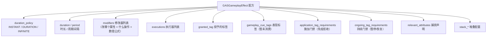

> "激素信号"比喻：GE 是身体里的激素——它不亲自干活，它**指示**身体
> （ASC/AttributeSet）去改数值、挂标签。效果就是"信息"，执行是别人的事。

### 4.2 三种持续策略（duration_policy）

| 策略 | 行为 | 对属性的影响 | 典型用途 |
| --- | --- | --- | --- |
| `INSTANT` | 立即结算一次，完事 | 改 **BaseValue**（买断） | 伤害、治疗、扣蓝 |
| `DURATION` | 挂账 N 秒，到期精确回滚 | 挂 **CurrentValue** 租约（含 granted_tag） | Buff、眩晕 |
| `INFINITE` | 永久，直到手动移除（handle） | 挂 **CurrentValue** 租约 | 装备、光环 |

**为什么 INSTANT 必须改 BaseValue？**
伤害是"永久扣血"，若挂在租约上，时间一到血自动恢复——游戏就疯了。
**为什么冷却 GE 必须是 DURATION？** 冷却靠"granted_tag 存在一段时间"工作，
INSTANT 路径根本不处理 granted_tag，配了等于没配。这些规则由
`_can_give_ability` 在**装载边界统一校验**（见第 6 章）。

### 4.3 Modifier：一条修改指令

一条 Modifier = 改哪个属性（attr_name）+ 什么操作（op）+ 数值怎么来（magnitude）。

**操作（ModifierOp）**：

| op | 公式 | 例子 |
| --- | --- | --- |
| `ADD` | `value + magnitude × stack_count` | 伤害 -50 |
| `MULTIPLY` | `value × (1 + magnitude)` | ×1.5（写 0.5） |
| `DIVIDE` | `value ÷ (1 + magnitude)` | ÷3（写 2） |
| `OVERRIDE` | `value = magnitude` | 直接设定（如传送门把移速设为 0） |

**数值公式（magnitude 家族）**——第 8 章详述，先认识四个成员：

| 类型 | 数值从哪来 | 何时定值 |
| --- | --- | --- |
| `ScalableFloat` | 直接配一个 float（可带等级曲线） | 创建 Spec 时（快照） |
| `AttributeBased` | 读 source/target 某属性的值 × 系数 | 可快照、可实时 |
| `SetByCaller` | 调用方运行时塞进 Spec 的信箱 | 永远实时（值出生得最晚） |
| `SetByCallerTimesAttribute` | 信箱值 × 属性值 × 系数 | 实时 |

### 4.4 生命周期：三种策略的三条路

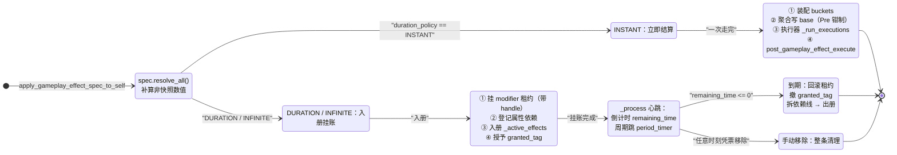

要点拆解：

- **INSTANT**：apply 调用内**同步走完**全部四步（modifiers → executions → post），
  返回 `INVALID_HANDLE (-1)`——打完即散，无票可发；
- **DURATION/INFINITE**：apply 只做**入册**（挂账 + 打标签），真正的"生效"靠
  `_process` 每帧心跳：`remaining_time -= delta`，归零即回滚。
  **"apply 时刻 ≠ 落账时刻"**——周期效果（DoT）更是 apply 时只入册，
  第一跳要等一个 `period` 之后才发生；
- **到期回滚是精确的**：`_cleanup_effect(entry)` 是唯一清理漏斗——
  按 handle 摘掉所有 AttributeSet 里的租约、撤销 granted_tag、拆掉依赖登记线。
  主动移除与自然到期**共用这一个漏斗**，保证行为一致。

### 4.5 granted_tag：状态效果的实现机制

"眩晕 1.5 秒"的完整配方：

```text
ge_stun.tres:
  duration_policy: DURATION
  duration: 1.5
  granted_tag: [State.Debuff.Stun]     ← 存在期间目标持续持有
```

- 施加瞬间：ASC 引用计数 +1，`State.Debuff.Stun` 出现；
- 到期瞬间：计数归零，标签消失，信号 `gameplay_tag_changed` 发出；
- 技能系统的门禁和打断（第 6 章）正是**监听这个标签的存亡**来工作的。

### 4.6 两道门禁：免疫拒收与暂停恢复

| 门禁 | 检查时机 | 用途 |
| --- | --- | --- |
| `application_tag_requirements` | apply 入口，先验后发 | 免疫：持有 `State.Debuff.Stun` 时拒收眩晕伤害 GE |
| `ongoing_tag_requirements` | 标签跳变沿持续检查 | 暂停/恢复：被沉默时，光环的 modifier 暂时"挂起"（suspended），沉默结束恢复 |

> 设计要点：**先验后发**——被拒的 GE 不消耗 handle 号、零副作用、打 warn。
> 这正是"校验压在边界"原则（配置合法性在装载时查，运行条件在入口查）。

### 4.7 与 UE 对照

| 概念 | UE | 本项目 |
| --- | --- | --- |
| 配方 | `UGameplayEffect` | `GASGameplayEffect` |
| 运行时实例 | `FGameplayEffectSpec` | `GASEffectSpec` |
| 上下文 | `FGameplayEffectContext` | `GASEffectContext`（instigator/effect_causer/ability/world_origin...） |
| 修改器 | `FGameplayModifierInfo` | `GEModifier` |
| 数值公式 | `FGameplayEffectModifierMagnitude` | `GASModifierMagnitude` 家族 |
| 活动容器 | `FActiveGameplayEffectsContainer` | ASC 内 `_active_effects` 数组 |
| 效果句柄 | `FActiveGameplayEffectHandle` | `int` handle（INVALID_HANDLE = -1） |
| 免疫 | `ApplicationTagRequirements` | `GASGameplayTagRequirements` |
| 暂停 | `OngoingTagRequirements` | 同上（modifier.suspended） |

---

## 第 5 章 ASC：系统的大脑

### 5.1 职责清单

`GASAbilitySystemComponent`（Node）是**全系统唯一的操作入口**。它管五本账：

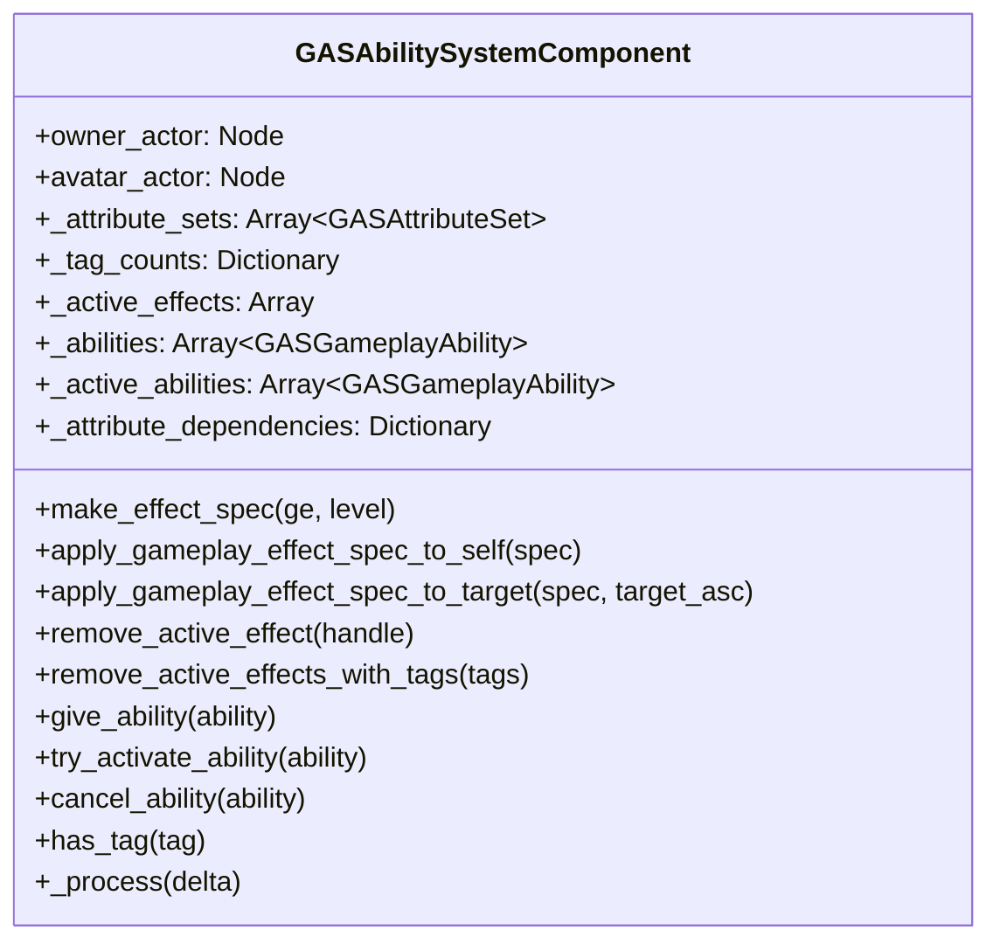

- **owner_actor**：逻辑所有者（英雄死后属性不丢 → PlayerState）
- **avatar_actor**：物理表现（死后销毁重建 → Character）
- 单机场景下两者通常同一个，但概念上必须分开（UE 同款设计）。

### 5.2 门票机制：handle 代替引用

GE 施加后，系统返回一个自增 `int handle`。**为什么不返回 Spec 引用？**

- 引用会过期（效果到期后对象已清理），持有者拿着尸体引用 = 崩溃隐患
  （DEVLOG Bug 2 的教训：Task 尸体崩溃）；
- handle 是**无记名门票**：ASC 独占账本数据，外人持票查询，
  "查不到"就优雅返回 false——**旧票无害化**（Buff 自然到期后，装备槽拿旧票
  来退场是合法业务，不是错误）；
- 两枚同款戒指 = 同一配方两份账，必须能"脱左手"精确退场——只有票能做到。


> UE 对照：`FActiveGameplayEffectHandle` 同样是"包装 int 的门票"。
> GDScript 务实用裸 int + 常量 `INVALID_HANDLE = -1`，并约定：
> INSTANT 效果**无票可发**（打完即散）。

### 5.3 apply 全流程（大脑的"主循环"之一）

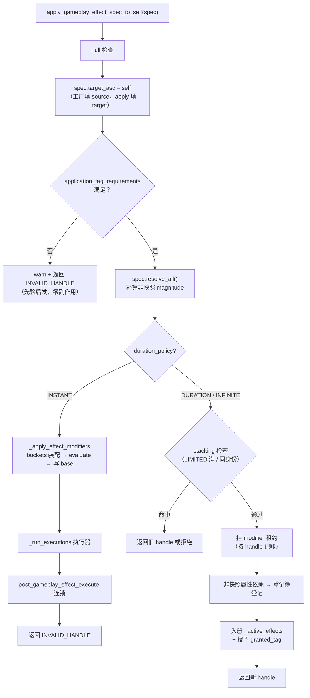

**为什么 INSTANT 和 DURATION 路径完全分开？**
INSTANT 是"买断"：当场结算、当场完事，无账可记；
DURATION 是"租约"：apply 只签约（入册），真正的续租/退租由 `_process` 管理。
两条路径共用同一套**落账漏斗**（`apply_modifiers_to_base`），
但生命周期管理完全不同——这就是"唯一权威不是唯一函数"的体现。

### 5.4 _process 心跳

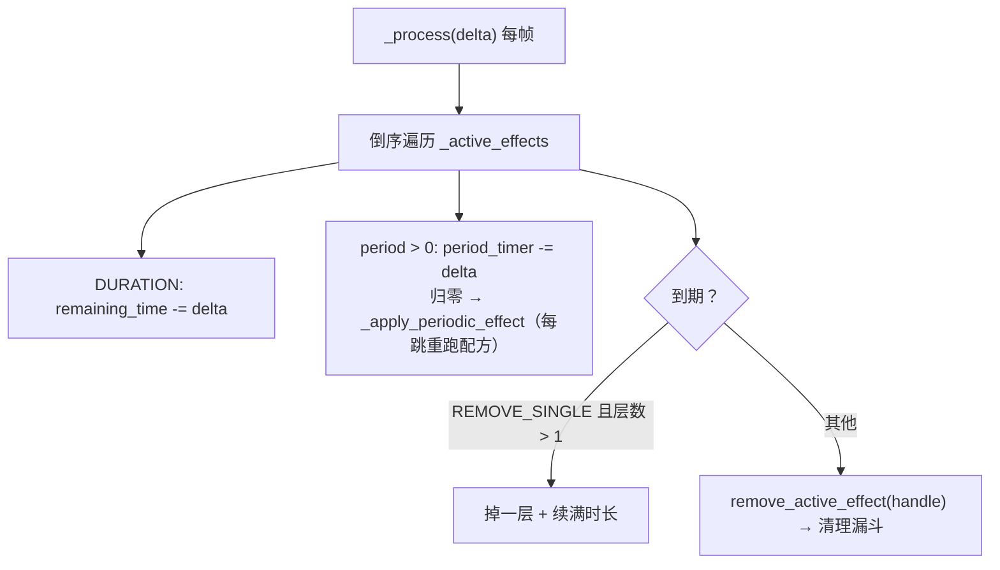

三个细节值得记住：

1. **倒序遍历**：遍历中可能删除当前条目，倒序安全（从末尾删不影响前面下标）；
2. **周期跳 = 每跳重跑配方**：DoT 每跳重新执行 modifiers + executions，
   非快照数值**每跳重新捕获**（攻击 buff 中途变化，中毒伤害立即跟随）——
   这印证了第 1 章"实例层"的意义：每次结算都是独立的"一道菜"；
3. **INSTANT 永不入册**：心跳直接跳过。

### 5.5 跨墙依赖：登记簿挂在"被读属性的家"

这是本项目最巧妙的设计之一（聚合器课第三阶段的成果）：

**问题**：`ge_buff_armor_from_attack`（DURATION，Armor += 30% × source.Attack，
非快照）挂在**目标**身上，但它依赖**施法者**的 Attack。施法者 Attack 变化时，
目标的 Armor 租约必须**实时重算**——可信号线怎么拉？"目标 ASC 的 attribute_changed"
只在自己家里响。

**方案**：登记簿不挂在 target，而是挂在**被读属性的家**：

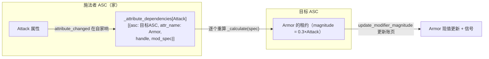

- **簿随事件走**：Attack 变 → 事件一定在施法者家发生 → 登记簿就在施法者家，
  **一根跨墙信号线都不用拉**；
- **条目**：`{asc, attr_name, handle, mod_spec}`——重算 = 用 spec 重新
  `_calculate()`，然后 `update_modifier_magnitude` 更新账页；
- **环保护**：`_recalc_stack` 链上已见 → warn + 返回（看得见，不处理；
  栈比布尔好：合法级联 A→B→C 还能走，只有真环才停）；
- **对称拆线**：`_cleanup_effect` 按 handle 删单条，删空才删键——死掉的监听者
  （尸体）不允许留在簿上（与 Task 尸体、tag 引用计数同一个对称性要求）。

> UE 对照：UE 把 `AttributeDependencies` 挂在持有 ActiveGE 的 target 容器，
> 跨 ASC 的非快照依赖是 UE 的已知薄弱点。**我们绕开它的姿势就是"簿随事件走"。**
> 这是"理解 UE 思想但修正 UE 缺陷"的范例。

### 5.6 与 UE 对照

| 职责 | UE | 本项目 |
| --- | --- | --- |
| 组件宿主 | `UAbilitySystemComponent`（ActorComponent） | `GASAbilitySystemComponent`（Node） |
| 主/化身 | OwnerActor / AvatarActor | owner_actor / avatar_actor |
| 标签计数 | `FGameplayTagCountContainer` | `_tag_counts` |
| 效果句柄 | `FActiveGameplayEffectHandle` | `int handle` |
| 依赖追踪 | `AttributeDependencies`（挂 target 容器） | `_attribute_dependencies`（挂被读属性的家） |
| 复制模式 | Full / Mixed / Minimal | **不做**（单机） |

---

## 第 6 章 GameplayAbility：动作命令

### 6.1 能力 = 配方 + 行为

`GASGameplayAbility`（Resource）描述"角色能做什么动作"。它有两半：

1. **数据（@export）**：标签条件、消耗 GE、冷却 GE；
2. **行为（子类覆写）**：`activate()` 里写"做什么"。

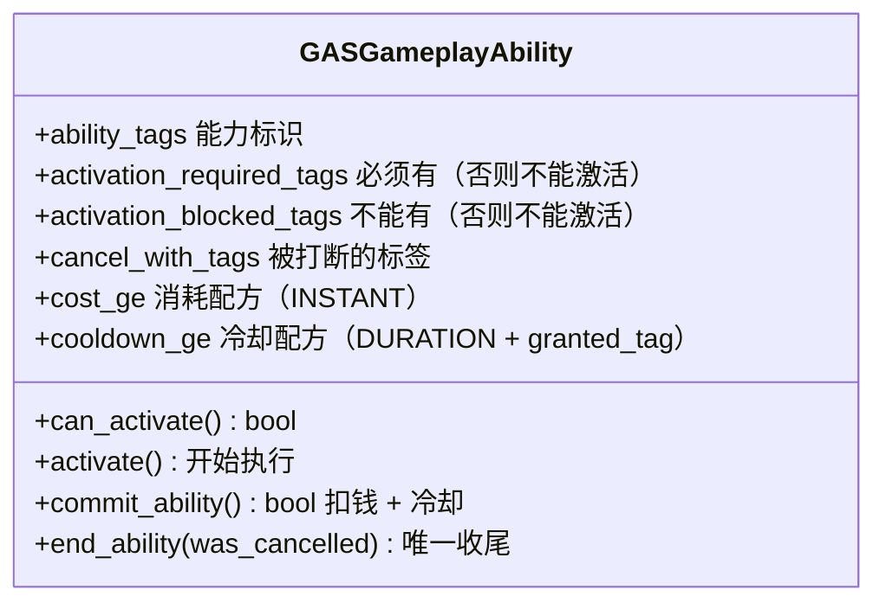

### 6.2 能力生命周期：一台四态机

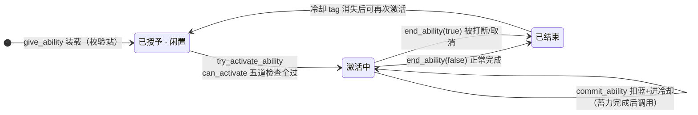

**关键纪律：所有能力路径的终点都必须是 `end_ability()`**（生命周期不变量）。
中断的 Task 必须被清理，信号必须恰好发一次。

### 6.3 can_activate：五道检查（CQS 的"查询"侧）

```gdscript
func can_activate() -> bool:
    if is_active:                     # ① 自己不能在施放中
        return false
    return _check_cooldown()          # ② 冷却 tag 不在身上
       and _check_block()             # ③ 阻塞标签（眩晕/沉默）不在身上
       and _check_cost()              # ④ 资源够（蓝量 ≥ 消耗）
       and _check_required()          # ⑤ 必需标签齐全
```

**为什么拆成四个谓词函数？**
可读性之外，更重要的是**查询与命令分离（CQS）**：

- `can_activate` 是**查询**：只读、幂等、随时可调，回答"现在能不能"；
- `commit_ability` 是**命令**：付费 + 冷却，只做一次，且必须基于当下状态。

> 硬证据：`commit_ability` 内部不能直接调 `can_activate`——
> 因为 commit 发生时 `is_active` 必然为 true，第一条检查永远不通过，
> 技能永远付不了费。**两个函数问的不是同一个问题。**

### 6.4 activate 与 commit 分离：为什么？

考虑蓄力技能：

```text
按下按键 → activate()     ← 开始蓄力（挂 Task）
            │
            ├─ 中途被眩晕打断 → end_ability(true) → 没扣蓝、没进冷却 ✓
            │
            └─ 蓄力完成 → commit_ability() → 扣蓝 + 进冷却 → 伤害落地
```

**如果合在一起**：按下去就扣蓝，蓄力被打断时玩家会骂"技能都没放出来凭什么扣我钱"。
所以激活（activate）与付费（commit）必须分离，**付费发生在技能真正成立的时刻**。
瞬发技能在 activate 里紧接着调 commit_ability 即可——两个函数是同一个
框架的两个阶段，不是两种技能。

### 6.5 push/pull 合力：眩晕如何打断技能

这是整个系统中最优雅的配合。阻断分两个方向：

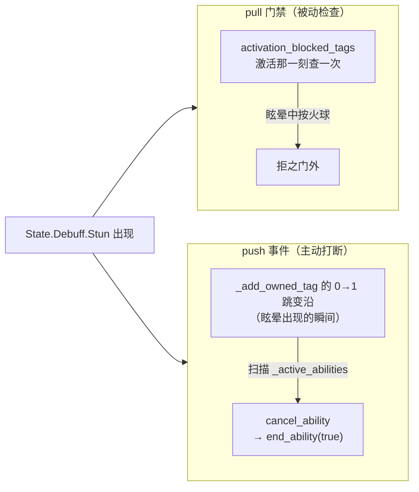

**为什么缺任何一边都是洞？**

- 只有门禁（pull）：眩晕在火球**蓄力中**落下——门禁早查完了，火球照常打出伤害；
- 只有打断（push）：push 只在 tag 出现的**那一瞬**扫一次屋，
  管不了"眩晕早已存在、之后才进屋的"——晕中起手照样激活（DEVLOG 第 10 节
  活体实验亲测漏球）。

> 一句话分工：**push 管"事件发生时屋里已有的"，pull 管"状态存在期间想进门的"。**

**技术细节**：
- 扫描用 `_active_abilities.duplicate()` 快照遍历（cancel 触发的信号回调可能
  任意增删列表，倒序不适用）；
- 命中即 break：断一次就够，剩下的 tag 不用再比；
- 技能声明 `cancel_with_tags` 存**宽泛**值（`State.Debuff`），
  精确的 `matches_tag` 由"谁调谁"决定——与 `has_tag` 方向一致（2.3 节）。

### 6.6 give_ability 校验站：配置错误在装载时炸

```gdscript
func _can_give_ability(ability) -> bool:
    # 冷却 GE 必须有 granted_tag 且必须是 DURATION
    # 消耗 GE 必须是 INSTANT
    # 拒绝重复 give
```

**为什么这些规则必须在装载时检查（而不是运行时静默失败）？**

- 冷却 GE 配成 INSTANT → 冷却永不生效（INSTANT 不处理 granted_tag），
  运行时表现为"技能没冷却"——**静默失效比崩溃更害人**；
- 消耗 GE 配成 DURATION → "借蓝放技能"（到期蓝自动回来）；
- **原则：校验压在装载边界一次做完，运行时检查只回答"现在能不能"。**

### 6.7 与 UE 对照

| 概念 | UE | 本项目 |
| --- | --- | --- |
| 能力 | `UGameplayAbility` | `GASGameplayAbility` |
| 能力规格 | `FGameplayAbilitySpec`（Class+Level+InputID...） | **不需要**：`give_ability` 时 `new()` 独立实例，状态直接挂资源实例上 |
| 激活入口 | `TryActivateAbility` | `try_activate_ability` |
| 付费/冷却 | `CommitAbility`（Cost GE + Cooldown GE） | `commit_ability`（同构） |
| 激活门禁 | `CanActivateAbility` | `can_activate` |
| 打断 | `CancelAbilitiesWithTag` / `BlockAbilitiesWithTag` | `cancel_with_tags` / `activation_blocked_tags` |
| 实例化策略 | InstancedPerActor / PerExecution / NonInstanced | 简化：每 `give_ability` 一份实例 |
| 输入绑定 | AbilityInputID → 输入 Action | 尚未实现（测试用按键直调） |

---

## 第 7 章 AbilityTask：异步时钟

### 7.1 为什么需要 Task？

技能激活后经常要**等**：等 1.5 秒蓄力、等玩家再按一次键（连招）、
等动画播到第 N 帧触发伤害判定。这些"异步等待"必须有统一管理：

- 每个等待都可以被打断（技能被眩晕打断 → 所有等待立刻作废）；
- 等待结束要通知能力继续执行。

**为什么不直接用 `Timer`？** Timer 只能等 N 秒。技能需要的异步操作远不止计时。
Task 是"异步操作"的统一基类框架，计时只是它的第一个子类
（未来：WaitInput / WaitAnimNotify / WaitTargetData……）。

### 7.2 为什么 Task 是 Node？为什么挂在 ASC 上？

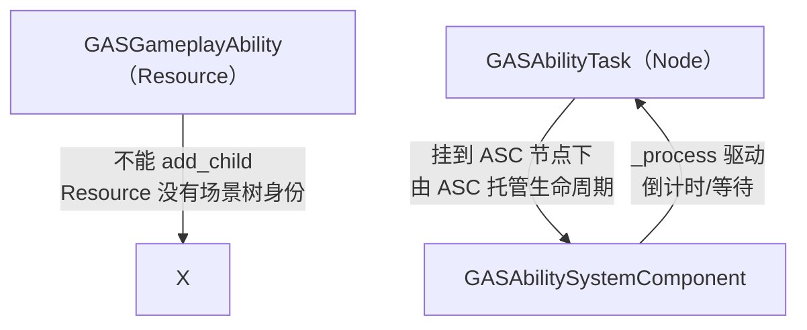

- Task 需要 `_process` 驱动异步逻辑 → **必须是 Node**（Resource 没有）；
- Ability 是 Resource，不能 add_child → 由 **ASC** 代为挂载（Task 的宿主）；
- 能力结束时 `end_ability` 遍历 `_active_task` 统一收尾。

### 7.3 Task 生命周期：唯一收尾漏斗

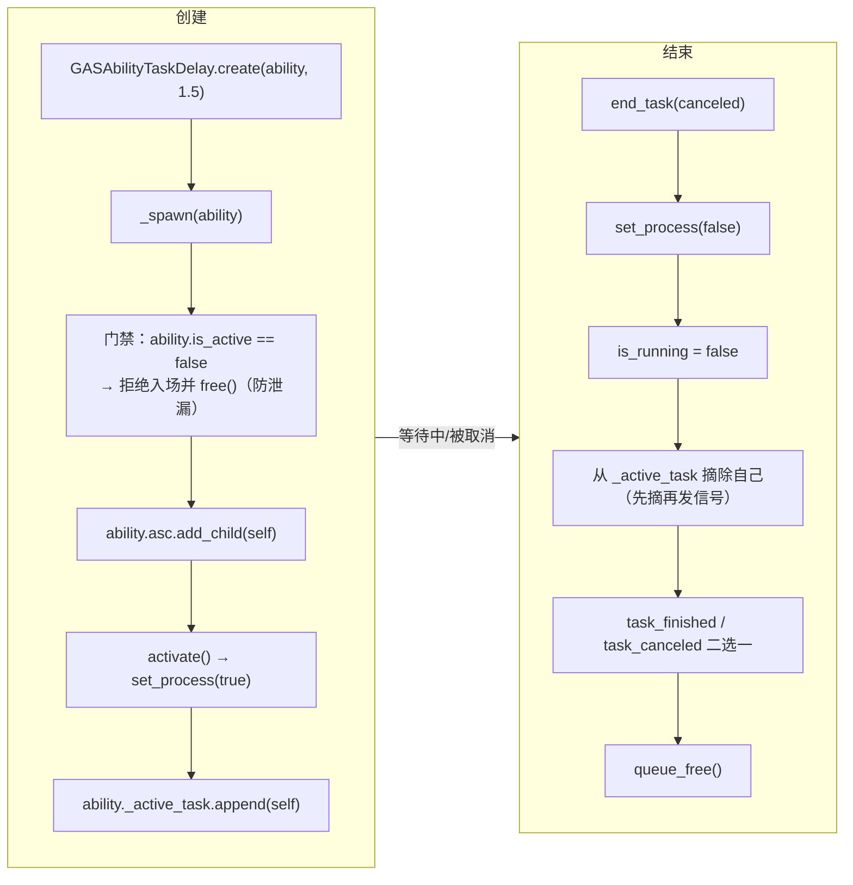

三个铁律（都是血泪换来的）：

1. **先摘除、再发信号**：信号回调可能立刻调 `end_ability` 读 `_active_task`，
   摘除必须发生在 emit 之前（DEVLOG Bug 2：Task 尸体崩溃）；
2. **双信号**：`task_finished`（自然完成）与 `task_canceled`（被打断）分开——
   被打断的火球**不得**触发"完成"回调继续掉血；
3. **所有结束路径汇入一个漏斗**：`end_ability` 倒序遍历取消任务，
   末尾 `assert(_active_task.is_empty())`——把静默兜底换成大声验尸。

### 7.4 为什么每个 Task 子类都要自己写 `static create()`？

GDScript 不支持泛型，基类无法提供通用的 `static create()` 来 new 出正确的子类型。
所以基类提供 `_spawn()` 承载通用逻辑（赋值、挂树、activate、登记），
子类的 `static create()` 只做三件事：`new()` 自己 + 设自己的参数 + 调 `_spawn()`。

**Task 按"异步模式"分类，不按技能分类**：

```text
GASAbilityTask（基类）
├── GASAbilityTaskDelay        ← 所有"等 N 秒"的技能共用
├── GASAbilityTask_WaitInput   ← 所有"等按键"的技能共用（规划中）
└── GASAbilityTask_WaitAnim    ← 所有"等动画帧"的技能共用（规划中）
```

大部分技能组合已有 Task 就行，跟搭积木一样——这就是 UE 的设计思想：
`UAbilityTask` + 官方任务库。

### 7.5 与 UE 对照

| 概念 | UE | 本项目 |
| --- | --- | --- |
| 任务基类 | `UGameplayTask` / `UAbilityTask` | `GASAbilityTask`（Node） |
| 创建 | `UAbilityTask::NewAbilityTask` | 子类 `static create()` + 基类 `_spawn()` |
| 完成回调 | `OnFinished` / `OnCancelled` Delegate | `task_finished` / `task_canceled` 信号 |
| 生命周期 | 能力结束时由 GAS 统一 EndAbility | `end_ability` 倒序遍历取消 |

---

## 第 8 章 数值计算进阶：magnitude 家族、快照与执行器

### 8.1 数值公式家族：一个数从哪来？

Modifier 的 magnitude 不再是裸 float，而是一个**会算的 Resource**（`GASModifierMagnitude`）：

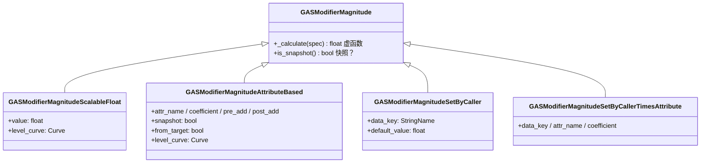

**数值按出生地分三类**（这是设计背后的原则）：

| 类型 | 值的来源 | 例子 |
| --- | --- | --- |
| ScalableFloat | 配置里写死（可挂等级曲线） | "固定 -50 伤害"、等级成长曲线 |
| AttributeBased | 随角色状态变 | "造成 30% 攻击力的伤害" |
| SetByCaller | 只在本次施放过程中产生 | "蓄力越久伤害越高"（蓄力时长是运行时才知道的事） |
| SetByCallerTimesAttribute | 事实 × 属性 | "蓄力 1.7s × 攻击力 × -0.5" |

> **分工纪律：游戏逻辑永远不该知道公式长什么样。**
> 代码只报告"飞了 1700 码"（事实），"每百码折多少伤"（公式）是策划在配方里的事。

### 8.2 快照 vs 实时：一个开关两种合法设计

`is_snapshot()` 控制**"数值何时定案"**：

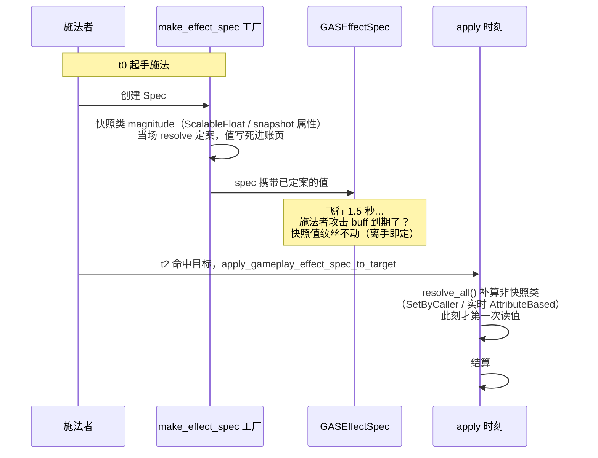

**选快照还是实时？经验法则：**

> **离手即定，持续附着**。
> - 效果离开施法者独立存在（火球弹道）→ **快照**：出手那刻的攻击力决定威力，
>   途中施法者掉 buff 甚至死了，火球也不缩水；
> - 效果持续挂在"源与目标的关系"上（"每秒攻击力 10%"的光环）→ **实时**：
>   攻击涨了，灼烧就该变疼。

**实现位置就是选择本身**：

- `GASModifierSpec._init` 时对 `is_snapshot() == true` 的 magnitude 当场 resolve
  （快照 = "过了这个时刻，后面发生什么都与我无关"）；
- apply 的 `resolve_all()` 补算非快照的（`resolved == false` 的账页）；
- **target-based 的 AttributeBased 只能实时**：创建 Spec 时目标还不存在
  （火球还没命中），值无处可读——这是"工厂填 source、apply 填 target"
  （第 5.3 节）的直接推论；
- SetByCaller **没有快照概念**：它的值出生在 apply 之前、创建之后，
  快照时刻它还不存在——"给空气拍照"。快照是属性捕获专属的词。

### 8.3 依赖重算：实时不是"只实时到 apply 那一刻"

第 8.2 节的"实时"如果停在 apply 时刻，挂上去之后源属性再变就没人管了。
第 5.5 节的**依赖登记簿**解决这个：非快照的 AttributeBased modifier 在挂账时
登记"我依赖谁"，被依赖属性变化 → 重算 magnitude → 更新账页 → 级联信号。

**环保护**：A 依赖 B、B 依赖 A 的重算链用 `_recalc_stack` 检测，
发现环就 warn + 返回（看得见，不处理）。

### 8.4 ExecutionCalculation：一次结算的公式

magnitude 是"**一个数**的公式"（返回 float，单方向），
execution 是"**一次结算**的公式"（返回一摞小票，多方向）：

```gdscript
class_name GASExecutionCalculation
extends Resource

func _execute(spec: GASEffectSpec) -> Array[GASModifierEvaluatedData]:
    # 例：伤害 = (攻击 × 1.5 − 目标护甲) × 暴击倍率
    # 返回多张"小票"：{receiver: TARGET/SOURCE, attr_name, op, value}
```

**为什么 magnitude 无法取代 execution？**
吸血就是例子：一条 modifier 只有一个 attr_name、一个 op——
"伤害写目标的 Health、回血写源的 Health"是**两笔账**，第二个座位不存在。
边界在**产出端宽度**，不在读端（magnitude 也能读目标属性）。

**小票（`GASModifierEvaluatedData`）** 是 execution 与结算管道之间的唯一通货：
配方只开票，落账归 ASC（`_run_executions` 把票按 TARGET/SOURCE 装进两个桶，
再走统一落账漏斗）。小票支持全部四种 op（ADD/MUL/DIV/OVERRIDE）——
这是聚合器课清算的旧债：以前 execution 只收 ADD。

**执行时刻法条**：

- INSTANT：modifiers 之后、post 之前，**同步执行一次**；
- 周期跳（DoT）：每跳同构执行一次（每跳重跑配方）；
- **DURATION/INFINITE 且 period ≤ 0 挂 execution → warn + 忽略**。
  原因：DURATION 的 modifier 用 target 的 handle 记账，execution 的 SOURCE 行
  会把账写进别人家，`_cleanup_effect` 只扫自己家 → 到期清不掉（幽灵账）。
  周期跳合法是因为每跳走一次性落账（`apply_base_value_change`），写完就完。

> UE 对照：`UGameplayEffectExecutionCalculation` +
> `RelevantAttributesToCapture` 捕获声明。本项目 execution 目前硬读属性
> （捕获声明只做在 modifier 侧），记入遗留。

### 8.5 捕获声明：系统要"看得见"依赖

`GE.relevant_attributes: Array[GASCaptureDefinition]`（`attr_name` + `from_target`）
把"这条 GE 要读谁的什么属性"**声明成数据**挂在配方上：

- 非快照的 AttributeBased modifier 必须声明，否则 apply **fail-closed 拒绝**
  （未声明 = 系统看不见依赖 = 无法登记重算 → 宁可报错也不带病运行）；
- 声明住配方（定义层），捕获值住账页（实例层）——和第 1 章分层同一个纹理。

---

## 第 9 章 Stacking：同一效果叠 N 层

### 9.1 问题

"同一个 GE 重复施加"（连按两次放同一技能 / 叠三枚戒指）必须立规矩：
叠多少层？满了怎么办？每层的时长怎么算？到期怎么掉层？

### 9.2 配置项

```mermaid
flowchart TD
    GE["GE 堆叠配置"] --> P1["stack_policy: NONE / LIMITED / REFRESH_DURATION"]
    GE --> P2["stack_limit: 上限层数"]
    GE --> P3["stack_type: AGGREGATE / STACK_BY_SOURCE<br/>（按来源各自计层）"]
    GE --> P4["expiration_policy: REMOVE_SINGLE / CLEAR_ENTIRE<br/>（逐层掉 / 整体清）"]
    GE --> P5["reset_period_on_stack: 叠层是否重置周期计时"]
```

**核心实现：合并为单条目 + 层数入账**。同身份 GE 重复施加不新建账页，
而是复用条目 `stack_count += 1`，并把层数同步进属性账页
（`GASModifierPile.stack_count`，evaluate 的 ADD 会 × 层数）：

```text
3 层"攻击 +50"叠加 = 1 条租约，magnitude × 3 = +150
```

**为什么合并而不是挂 3 条？**
合并让"层数上限、到期逐层掉"成为可能：3 条独立租约到期时间各自独立，
无法表达"同一叠、逐层掉、每层续满时长"。层数进账页后，
`get_stack_count(handle)` 一个查询就能回答"现在叠了几层"。

### 9.3 三种策略的行为差异

| 策略 | 重复施加时 | 例子 |
| --- | --- | --- |
| `NONE` | 每次都新建独立租约（默认） | 两次不同来源的灼烧各自计时 |
| `LIMITED` | 合并层数，满 `stack_limit` 拒绝（先验后发，被拒不消耗 handle 号） | 风暴之盾最多 3 层 |
| `REFRESH_DURATION` | 合并层数 + **重置剩余时长** + 返回原 handle | 刷新类 Buff：续命不叠加 |

### 9.4 到期策略

```mermaid
flowchart TD
    EXP{"到期（remaining_time ≤ 0）"} -->|"REMOVE_SINGLE 且层数 > 1"| D1["掉一层<br/>stack_count -= 1<br/>remaining_time = 满时长（续满）"]
    EXP -->|"CLEAR_ENTIRE 或层数 = 1"| D2["整条移除（清理漏斗）"]
```

> **为什么掉层必须续满时长？** 不续的话，下一帧又到期 → 同帧连环掉层，
> REMOVE_SINGLE 悄悄变成 CLEAR_ENTIRE。续时长是必须项不是选项。

**主动移除（`remove_active_effect`）永远整条**——"到期策略是时间到了的政策，
不该劫持主动动作"（UE 同款）。

### 9.5 身份判定

`_same_ge` 用 `resource_path` 判定"是不是同一个 GE"（磁盘资源路径稳定唯一，
引用兜底）。为什么不用 `get_rid()`？Godot 自定义 Resource 的 `get_rid()` 恒返回
`RID(0)`——任意两个 GE 都"相等"，跨 GE 误拒（DEVLOG 实测实锤的潜伏 bug）。

---

## 第 10 章 完整链路：火球术全流程（期末考）

把前面所有章节串起来。场景设定（全部来自项目真实的测试资产）：

```text
角色：Health 500 / MaxHealth 500 / Attack 100 / Mana 1000
能力：GAFireBoltAbility
  蓄力 1.5 秒 → 伤害 = 蓄力时长(1.7) × 施法者 Attack × (-0.5) = 1.7 × 100 × (-0.5) = -85
  cost_ge：扣 100 蓝（INSTANT）
  cooldown_ge：3 秒冷却（DURATION + granted_tag: Ability.Fire.Cooldown）
  标签配置：activation_blocked_tags 含 State.Debuff（眩晕中不能放）
           cancel_with_tags 含 State.Debuff（眩晕打断蓄力）
```

### 10.1 施放成功的主路径

```mermaid
sequenceDiagram
    autonumber
    participant P as 玩家
    participant ASC as ASC（大脑）
    participant GA as 火球能力
    participant T as GASAbilityTaskDelay
    participant AS as AttributeSet
    participant C as 冷却GE账页

    P->>ASC: 按键 → try_activate_ability(fire_bolt)
    ASC->>GA: can_activate() 五道检查
    Note over GA: ① 不在施放中 ✓ ② 无冷却 tag ✓<br/>③ 无眩晕 tag ✓ ④ 蓝量够 ✓ ⑤ 必需标签 ✓
    ASC->>GA: 先入册 _active_abilities（先记账，再放权）
    ASC->>GA: activate()
    GA->>GA: is_active = true；发 ability_activated
    GA->>GA: 创建伤害 spec（make_effect_spec）
    Note over GA: SetByCallerTimesAttribute 是非快照类<br/>此处只登记 data_key，不定值
    GA->>GA: spec 信箱塞入 charge_time = 1.7
    GA->>T: GASAbilityTaskDelay.create(self, 1.5)
    T->>T: _spawn：挂到 ASC 节点下 + activate() + 入 _active_task
    T->>GA: task_finished 连接 _on_charge_down
    Note over T: ---- 1.5 秒蓄力（_process 倒计时）----
    T->>GA: task_finished.emit()
    GA->>GA: commit_ability() ← 关键！此刻才付费
    GA->>ASC: apply cost_ge（INSTANT）
    ASC->>AS: Health 不动，Mana 1000 → 900（扣蓝）
    GA->>ASC: apply cooldown_ge（DURATION 3s）
    ASC->>C: 入册：modifier 无 + granted_tag 授予<br/>Ability.Fire.Cooldown 出现（计数 1）
    GA->>ASC: apply 伤害 spec（resolve_all 此刻才算：-85）
    ASC->>AS: INSTANT：buckets 装配 → evaluate → 写 base
    AS->>AS: pre_attribute_change：500-85=415，钳制 OK
    AS-->>ASC: attribute_changed("Health", 415, 500) → UI 刷新
    ASC->>AS: post_gameplay_effect_execute（死亡检测等）
    GA->>GA: end_ability(false)
    ASC->>ASC: _on_ability_ended：从 _active_abilities 移除
    Note over C: ---- 3 秒后 ----
    C->>ASC: 到期 → 清理漏斗 → granted_tag 撤销
    C-->>ASC: gameplay_tag_changed(tag, false) → 冷却状态结束
```

### 10.2 打断路径（眩晕）

```mermaid
sequenceDiagram
    autonumber
    participant ASC as ASC
    participant ST as 眩晕GE
    participant GA as 火球能力（蓄力中）
    participant T as 蓄力Task

    ST->>ASC: apply ge_stun（DURATION 1.5s，granted_tag: Stun）
    ASC->>ASC: _add_owned_tag：计数 0→1（跳变沿！）
    ASC->>ASC: 扫描 _active_abilities：火球 cancel_with_tags 命中 Stun
    ASC->>GA: cancel_ability(fire_bolt)
    GA->>GA: end_ability(true)
    GA->>T: 倒序遍历 _active_task：end_task(canceled=true)
    T->>T: 摘除自己 + 发 task_canceled（不发 finished！）
    T->>T: queue_free()
    GA->>ASC: ability_ended(was_cancelled=true)
    Note over GA: 结果：伤害没落地、Mana 1000 分文未动、冷却没进<br/>——commit 根本没发生过
```

### 10.3 这张图里藏着的全部设计

| 时序图中的现象 | 背后的设计（章节） |
| --- | --- |
| `can_activate` 五道检查全过才激活 | CQS + 门禁（6.3） |
| 先入册再 activate | 先记账，再放权（Bug 1 教训） |
| spec 创建时只登记 key 不定值 | 快照 vs 实时：SetByCaller 值出生最晚（8.2） |
| 1.5 秒后 task_finished 才 commit | activate 与 commit 分离（6.4） |
| 蓄力中眩晕 → 只发 task_canceled | 双信号：被打断不得继续掉血（7.3） |
| 冷却 tag 出现/消失都有信号 | tag 引用计数 + 跳变沿（2.4） |
| 到期精确回滚 | 租约账页 + handle + 唯一清理漏斗（4.4） |

---

## 第 11 章 与 UE 的全面对比与设计原则

### 11.1 类映射总表

| UE | 本项目 Godot | 基础类型 | 差异说明 |
| --- | --- | --- | --- |
| `UAbilitySystemComponent` | `GASAbilitySystemComponent` | Node | 无复制模式 |
| `UAttributeSet` | `GASAttributeSet` | Resource | UE 是 Component，因复制需要 |
| `FGameplayAttributeData` | `GASAttributeDATA` | RefCounted | 结构一致 |
| `FAggregator` | `evaluate()` 静态函数 | - | UE 多 Channel，本项目做不了 |
| `UGameplayEffect` | `GASGameplayEffect` | Resource | 字段基本同构 |
| `FGameplayEffectSpec` | `GASEffectSpec` | RefCounted | 同构 |
| `FGameplayEffectContext` | `GASEffectContext` | RefCounted | world_origin 等字段留坑待用 |
| `FActiveGameplayEffectHandle` | `int handle` | - | 裸 int + INVALID_HANDLE 常量 |
| `FActiveGameplayEffectsContainer` | `_active_effects` 数组 | - | - |
| `UGameplayAbility` | `GASGameplayAbility` | Resource | - |
| `FGameplayAbilitySpec` | 无 | - | 直接实例化，状态挂资源实例 |
| `UAbilityTask` | `GASAbilityTask` | Node | 同构 |
| `FGameplayTag` | `FGameplayTag` | RefCounted + 享元池 | 同构（StringName 全局 ID） |
| `FGameplayTagContainer` | `FGameplayTagContainer` | Resource | 同构 |
| `FGameplayTagCountContainer` | `_tag_counts` 引用计数 | - | UE 维护祖先计数（本项目遍历） |
| `FGameplayModifierMagnitude` | `GASModifierMagnitude` 家族 | Resource | 四类少 CustomCalculation 一类 |
| `UGameplayEffectExecutionCalculation` | `GASExecutionCalculation` | Resource | 捕获声明未做（硬读） |
| `UGameplayCueManager` | 未实现 | - | `gameplay_cue_tags` 待消费 |
| `UGameplayAbilityTargetActor` | 未实现 | - | target 目前是写死引用 |
| 网络预测 / PredictionKey | **明确不做** | - | 单机项目 |

### 11.2 做了 / 没做 / 故意不做

**已经实现**（截至本文档编写时）：

- ✅ Tag 系统（享元 + 树 + 引用计数 + 层级匹配）
- ✅ 属性系统（Base/Current 双值 + evaluate 聚合 + Pre/Post 钩子 + Meta Attribute）
- ✅ GE 三种策略 + 周期 DoT + granted_tag + 两道门禁 + Stacking 全家桶
- ✅ magnitude 家族（ScalableFloat / AttributeBased / SetByCaller / SetByCaller×Attribute）
- ✅ ExecutionCalculation + 双桶落账 + 依赖登记簿实时重算
- ✅ Ability 生命周期 + CQS + push/pull 打断 + Task 异步框架
- ✅ 测试场景 + F 键一键自动化回归

**规划中**（见第 12 章路线图）：GameplayCue（表现层）、更多 Task、
TargetData、捕获声明（execution 侧）。

**明确不做**：网络复制与客户端预测（单机项目；Godot 网络模型与 UE 差异过大）。

### 11.3 本项目沉淀的十二条设计原则（速查）

1. **先记账，再放权**：框架状态登记先于用户代码；emit 前完成摘除。
2. **唯一收尾漏斗 + 幂等**：N 条退出路径汇入 1 个清理函数（end_ability /
   end_task / _cleanup_effect），漏斗自身经得起走两次。
3. **生命周期不变量 + 配对**：谁登记谁注销；所有 Ability 路径的终点都是 end_ability。
4. **门票代替引用**：跨系统凭据用 ID 不用对象引用；旧票优雅 false。
5. **fail-open vs fail-closed**：付费/权限关口一律 fail-closed + 大声报告；
   "查无此 tag"是答案，"属性不存在"是事故。
6. **查询与命令分离（CQS）**：检查随时做，命令只做一次且基于当下。
7. **校验压在边界**：配置合法性装载时查一次，运行时只回答"现在能不能"。
8. **计数 + 跳变沿**：多方共享状态用引用计数；信号只在存在性改变时发。
9. **数据当参数传**：清理函数吃 entry 不删后回查；回调会动集合时用快照 + 查活。
10. **Resource = 定义，Spec = 实例**：共享配方 vs 每次施放一份拷贝；
    运行时数据永不进共享资源。
11. **改副本，不另起炉灶**：折算改在配方副本上，配方仍是唯一事实源。
12. **报错必须带拦截**：警报器和门闩成对出现；失败停在最近的合法状态。

---

## 第 12 章 项目结构、测试与路线图

### 12.1 目录结构

```text
gas_project/
├── project.godot                     # 注册了 3 个插件 + GameplayTags autoload
├── addons/
│   ├── gameplay_tags/                # Tag 插件（独立）
│   │   ├── gameplay_tags.gd          #   EditorPlugin：注册 autoload/面板/检查器
│   │   └── scripts/
│   │       ├── gameplay_tag_manager.gd    #   单例：双轨索引 + 享元池
│   │       ├── structure/                 #   FGameplayTag / Container / Node / 多叉树
│   │       └── resources/gameplay_tag_list.gd  # cfg 文件读写
│   ├── gameplay_abilities_system/    # GAS 插件
│   │   ├── scripts/
│   │   │   ├── enums.gd                    # DurationPolicy / ModifierOp / Stacking...
│   │   │   ├── attribute_data.gd           # 单个属性（evaluate 权威）
│   │   │   ├── attribute_set.gd            # 属性集（Pre/Post 钩子）
│   │   │   ├── gameplay_effect.gd          # GE 配方
│   │   │   ├── gameplay_effect_modifier.gd # 一条修改指令
│   │   │   ├── gameplay_effect_spec.gd     # GE 实例
│   │   │   ├── gameplay_effect_context.gd  # 效果上下文
│   │   │   ├── ability_system_component.gd # 大脑
│   │   │   ├── gameplay_ability.gd         # 能力
│   │   │   ├── ability_task.gd / ability_task_delay.gd
│   │   │   ├── modifier_pile.gd / modifier_bucket.gd / modifier_spec.gd
│   │   │   ├── modifier_evaluated_data.gd  # execution 小票
│   │   │   ├── gameplay_effect_capture_definition.gd  # 捕获声明
│   │   │   ├── gameplay_tag_requirements.gd             # 门禁条件
│   │   │   ├── modifier_magnitude/        # magnitude 家族（4 个文件）
│   │   │   └── execution_calculation/     # 执行器基类
│   │   └── test/                         # TestScene + 测试键 + 测试 GE/能力
│   └── logger/                          # GameLogger
├── config/                             # 默认标签配置
└── docs/                               # 本文档 + UE 参考文档
```

### 12.2 动手实验：TestScene

`addons/gameplay_abilities_system/test/TestScene.tscn` 是活的实验场，
运行后按键盘即可观察每一步（输出全部经过 GameLogger 带时间戳）：

| 键 | 验证内容 |
| --- | --- |
| `1` | INSTANT 伤害 -50 |
| `2` | DURATION 攻击 Buff（到期回退） |
| `3` | DoT 中毒（周期跳 -5） |
| `4` | 大额伤害（Pre 钳制到 0） |
| `5` | 眩晕（tag 授予/撤销，连按 = 计数） |
| `6` | 火球全流程（蓄力 1.5s → -85）；蓄力中再按 = 取消（不扣蓝不进 CD） |
| `7/8/9` | 瞬发 / 多 Task / 取消（回归键） |
| `0 / -` | 风暴之盾 挂（存 handle）/ 摘（按票退场） |
| `=` | 旧票重试（期望 false——门票无害化） |
| `F` | **一键自动化回归**（增量断言全绿） |
| `T/Y` | SetByCaller 传值 / 缺省 fail 路径 |
| `O` | INSTANT 攻防结算（攻击 − 目标护甲） |
| `P/A` | DoT 攻防结算 / 护甲 Buff（实时重算对照） |
| `S` | 跨墙依赖实时重算（Armor += 30% × source.Attack） |
| `Q/W/E` | 叠层 / 刷新 / 等级曲线（进阶键） |

### 12.3 路线图

```mermaid
flowchart LR
    DONE["✅ 已关账：<br/>属性 → GE → Ability → Task<br/>→ MMC → Execution → 聚合器<br/>→ 依赖登记簿 → Stacking"] --> NEXT["下一步梯队"]
    NEXT --> CUE["GameplayCue<br/>表现层（gameplay_cue_tags 待消费）"]
    NEXT --> TASK2["更多 Task<br/>WaitInput / WaitAnimNotify"]
    NEXT --> TARGET["TargetData 目标选择"]
    NEXT --> TAG2["Tag 驱动 GE 门禁收尾<br/>+ Ability 互斥矩阵"]
```

---

## 附录：名词速查表

| 名词 | 一句话解释 |
| --- | --- |
| GAS | Gameplay Ability System，能力/属性/状态框架 |
| ASC | AbilitySystemComponent，系统的"大脑"、唯一入口 |
| GE | GameplayEffect，效果配方（数据，无逻辑） |
| Spec | 效果的运行时实例（"一道菜"） |
| Modifier | 一条修改指令：改哪个属性 × 什么操作 × 数值公式 |
| magnitude | 数值公式对象（ScalableFloat / AttributeBased / SetByCaller...） |
| Attribute | 属性（float），只有通过 GE 才能合法修改 |
| BaseValue / CurrentValue | 永久值 / 当前值（Base + 临时租约） |
| Meta Attribute | 效果间传话的临时属性（如 IncomingDamage），用完归零 |
| handle | 效果门票（int），凭票精确退场，旧票无害化 |
| granted_tag | GE 存在期间授予目标的标签，到期自动撤销 |
| Task | 异步操作（Node），挂在 ASC 下用 _process 驱动 |
| 快照 | 数值在创建 Spec 时刻定案（离手即定） |
| 实时 | 数值在 apply/每跳时现场读（持续附着） |
| 依赖登记簿 | "谁依赖谁"的账本，属性变了自动重算 |
| CQS | 查询与命令分离：检查随时做，付费只做一次 |
| push / pull | 事件主动打断 / 门禁被动拦截，缺一不可 |

---

> 本文档基于项目实际代码（`addons/gameplay_abilities_system` 与 `addons/gameplay_tags`）
> 与开发日志（DEVLOG.md）编写。若与代码行为不符，以代码为准，欢迎更新本文档。
